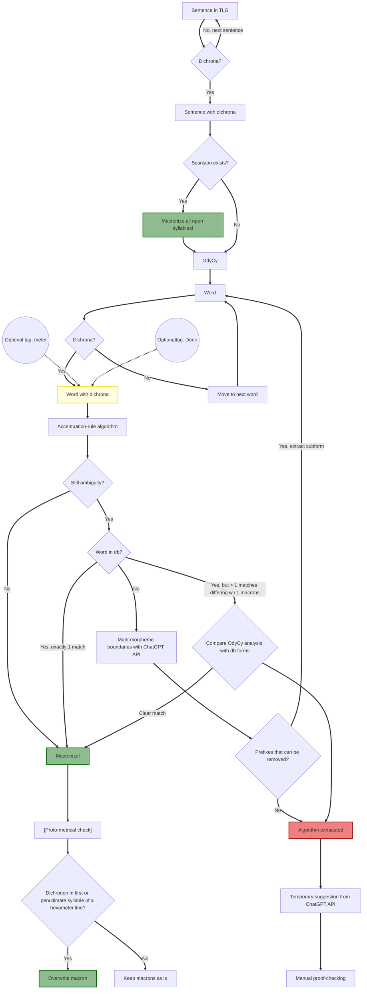

# Macronizing the TLG 

## Conventions/Priorities
1) Successful macronization of a corpus is gauged solely on the basis of:
   1)  open syllables and
   2)  excludes line-final syllables (syllaba brevis in positio longo)
   
When all *non-final dichrona in open syllables* are disambiguated, the project is complete. 

## Macronizer work-flow for open-syllable dichrona in the TLG:

_Notes_:
- A dichronon (pl. dichrona) is a α, ι or υ (alpha, iota or ypsilon) outside of diphthongs. Alpha with iota subscriptum (ᾳ) is a s.c. long diphthong, and hence not a dichronon.
- The theoretical goal "in the limit" is that all open syllables be macronized. Hence, no syllable weights are implied; every open-syllable dichronon not explicitly macronized is considered ambiguous. 
- By 'macronizing' is meant adding either a macron (symbol: dash, -) or breve (symbol: caret, ^). Analogously, 'macron/macra' is shorthand for 'macron/macra and breve/brevia'.
- A word is considered 'macronized', when every dichronon in it is mapped to a - or ^ or explicitly marked as problematic.
- Likewise, a sentence is considered 'macronized', when every word in it is macronized.
- Hence, the TLG is considered 'macronized' when every sentence in it is macronized.

- **NB1:** The "paroxytone + short ultima" rule for the penultima *depends on endings having been macronized* since a huge amount of words end on dichrona. Likewise, the "paroxytone + long penultima" for the ultima *depends on penultima having been macronized*, to the extent penultima are dichronic. Hence these two rules should be run 

_Specifics of the flow chart_
- Macronizing does not overwrite earlier macrons, i.e. the results of "upstream" macronizing, unless otherwise stated (which does occur).

### Methodological problem										

Wiktionary works under the following conventions:

>Some dictionaries and lexicons operate under the standard that an unmarked vowel is short, while a long vowel will have a macron. In Wiktionary, an unmarked vowel is considered ambiguous; short vowels should be marked with breves. For instance, the second iota of πολῑτικός (polītikós) is considered ambiguous; this word should be spelled πολῑτῐκός (polītikós), with a breve on the second iota to indicate that it is short. 

Cf. https://en.wiktionary.org/wiki/Wiktionary:About_Ancient_Greek (accessed 4 dec. 2024)

- Specific problem 1: Marking of superheavies is in general irreducibly conjectural: wiktionaries decisions are often scientifically unfounded.
