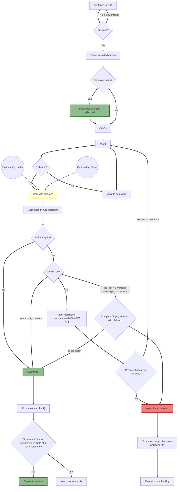

# Macronizing the TLG 


macronizer workflow
1) apply rules of accentuation
2) if the line of the word is scanned in hypotactic, check that
3) check "hardcoded" database
4) if not in db:
   1) get morphemes from GPT API
   2) apply algorithmic morph rules
   3) if still undecided, send to GPT

### Methodological problem

- Specific problem 1: Marking of superheavies is in general irreducibly conjectural: wiktionaries decisions are often scientifically unfounded.

From the grc-decl docs https://youtu.be/nwEgqqofpLk?si=3WpKhLktjb3bVvQt :


>The module adds a breve or macron to mark the length of the monophthongs α, ι, υ (a, i, u) if they do not bear a macron, breve, circumflex, or iota subscript and the length can be deduced from the rules of accent. Thus, {{grc-decl|ἄστρον|ἄστρου}} generates the same forms as {{grc-decl|ᾰ̓́στρον|ᾰ̓́στρου}}. This is done by the mark_implied_length and harmonize_length functions in Module:grc-accent. 


```
function export.mark_implied_length(word, return_tokens, short_diphthong)
	word = decompose(word)
	-- Do nothing if there are no vowel letters that could be ambiguous.
	if not find(word, either_vowel) then
		if return_tokens then
			return tokenize(word)
		else
			return word
		end
	end
	
	local tokens = shallowcopy(tokenize(word))
	local vowels = export.get_vowel_info(tokens, short_diphthong)
	
	if #vowels >= 2 then
		local ultima = vowels[1]
		local ultima_i = ultima.index
		
		local penult = vowels[2]
		local penult_i = penult.index
		
		if penult.length == "either" and ultima.length == "short" then
			if penult.accent == CIRCUMFLEX then
				tokens[penult_i] = add(tokens[penult_i], MACRON)
			elseif penult.accent == ACUTE then
				tokens[penult_i] = add(tokens[penult_i], BREVE)
			end
		elseif penult.length == "long" and ultima.length == "either" then
			if penult.accent == CIRCUMFLEX then
				tokens[ultima_i] = add(tokens[ultima_i], BREVE)
			elseif penult.accent == ACUTE then
				tokens[ultima_i] = add(tokens[ultima_i], MACRON)
			end
		end
		
		local antepenult = vowels[3]
		if antepenult and antepenult.accent and ultima.length == "either" then
			tokens[ultima_i] = add(tokens[ultima_i], BREVE)
		end
	end
	
	if return_tokens then
		return tokens
	else
		return table.concat(tokens)
	end
end
```

So what is in here? We have the σωτῆρα-rule:
```
if penult.length == "either" and ultima.length == "short" then
    if penult.accent == CIRCUMFLEX then
        tokens[penult.index] = add(tokens[penult.index], MACRON)
    elseif penult.accent == ACUTE then
        tokens[penult.index] = add(tokens[penult.index], BREVE)
    end
```

## rfdrfdf
Example: ἵσταμαι ^ (present), ἵσταμαι - (imperfect)

## Macronizer work-flow for open-syllable dichrona in the TLG:

_Notes_:
- A dichronon (pl. dichrona) is a α, ι or υ (alpha, iota or ypsilon) outside of diphthongs. Alpha with iota subscriptum (ᾳ) is a s.c. long diphthong, and hence not a dichronon.
- The theoretical goal "in the limit" is that all open syllables be macronized. Hence, no syllable weights are implied; every open-syllable dichronon not explicitly macronized is considered ambiguous. 
- By 'macronizing' is meant adding either a macron (symbol: dash, -) or breve (symbol: caret, ^). Analogously, 'macron/macra' is shorthand for 'macron/macra and breve/brevia'.
- A word is considered 'macronized', when every dichronon in it is mapped to a - or ^ or explicitly marked as problematic.
- Likewise, a sentence is considered 'macronized', when every word in it is macronized.
- Hence, the TLG is considered 'macronized' when every sentence in it is macronized.

_Specifics of the flow chart_
- Macronizing does not overwrite earlier macrons, i.e. the results of "upstream" macronizing, unless otherwise stated (which does occur).


