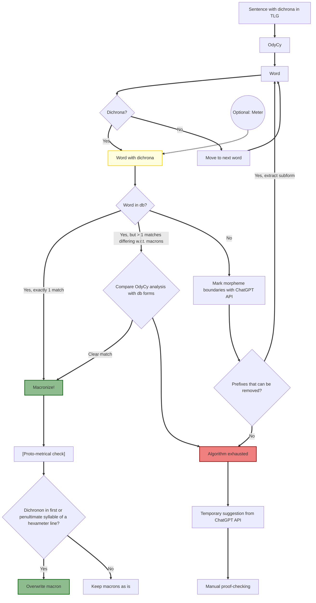

# TO-DO

- find all wiktionary titles to scrape
- GPT4o for morphology

macronizer workflow
1) apply rules of accentuation
2) if the line of the word is scanned in hypotactic, check that
3) check "hardcoded" database
4) if not in db:
   1) get morphemes from GPT API
   2) apply algorithmic morph rules
   3) if still undecided, send to GPT

NB
- Marking of superheavies is in general irreducibly conjectural: wiktionaries decisions are often scientifically unfounded.

Example: ἵσταμαι ^ (present), ἵσταμαι - (imperfect)

